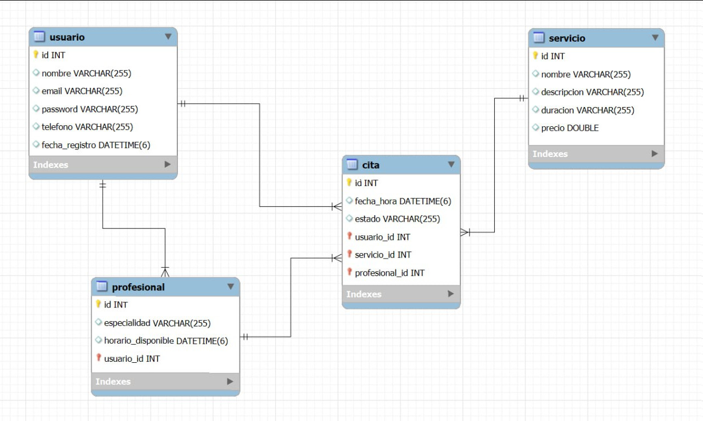

# Sistema de Gestión de Citas - Consultoría Profesional

ANDREY ERNESTO RONDON CORREDOR ADSO    3063267

##  Descripción del Proyecto

Sistema completo de gestión de citas para consultoría profesional desarrollado con **Spring Boot** como parte de una evaluación técnica. El sistema permite la administración de clientes, servicios, profesionales y citas, con un enfoque específico en consultoría tecnológica para startups.

##  Esquema de la Base de Datos

El sistema utiliza una base de datos MySQL con el siguiente esquema:

 

### Tablas Principales

- **usuario**: Almacena la información de los clientes del sistema
- **profesional**: Gestiona los consultores y sus especialidades
- **servicio**: Catálogo de tipos de consultoría ofrecidos
- **cita**: Sistema de reservas y sesiones de asesoramiento

##  Tecnologías Utilizadas

### Backend
- **Spring Boot 3.2.7** - Framework principal
- **Spring Data JPA** - Persistencia y repositorios
- **Spring Security** - Autenticación y autorización
- **Hibernate** - ORM para mapeo objeto-relacional
- **MySQL** - Base de datos relacional
- **Maven** - Gestión de dependencias

### Frontend
- **Thymeleaf** - Motor de plantillas
- **Bootstrap 5** - Framework CSS
- **HTML5** - Estructura web
- **JavaScript** - Interactividad

### Herramientas
- **Git & GitHub** - Control de versiones
- **Eclipse/STS** - IDE de desarrollo
- **MySQL Workbench** - Administración de BD

##  Funcionalidades Implementadas

###  Autenticación y Seguridad
- [x] Spring Security configurado
- [x] Página de login personalizada
- [x] Protección de endpoints
- [x] Logout funcional

###  Gestión de Usuarios (Clientes)
- [x] CRUD completo de usuarios
- [x] Validación de campos
- [x] Registro automático de fecha
- [x] Búsqueda por email

###  Gestión de Servicios
- [x] CRUD completo de servicios
- [x] Catálogo de consultorías
- [x] Precios y descripciones
- [x] Duración de sesiones

###  Relaciones JPA
- [x] Relación OneToOne Usuario-Profesional
- [x] Relación OneToMany Usuario-Cita
- [x] Relación ManyToOne Cita-Servicio y Cita-Profesional
- [x] Claves foráneas correctamente mapeadas

###  Frontend y UX
- [x] Interfaz con Bootstrap 5
- [x] Diseño responsive
- [x] Navegación intuitiva
- [x] Formularios validados

## Instalación

¿Cómo esta intru? ya sé que usted sabe hacerlo, pero no esta demas colocar la instalación asi que hagame el favor y clona el repositorio, luego Configura la base de datos MySQL en `application.properties` Ejecuta la aplicación, luego se va a su navegador donde va copiar y pegar lo siguiente`http://localhost:8085` eso es todo gracias. Aprendí mucho en esta evaluación

